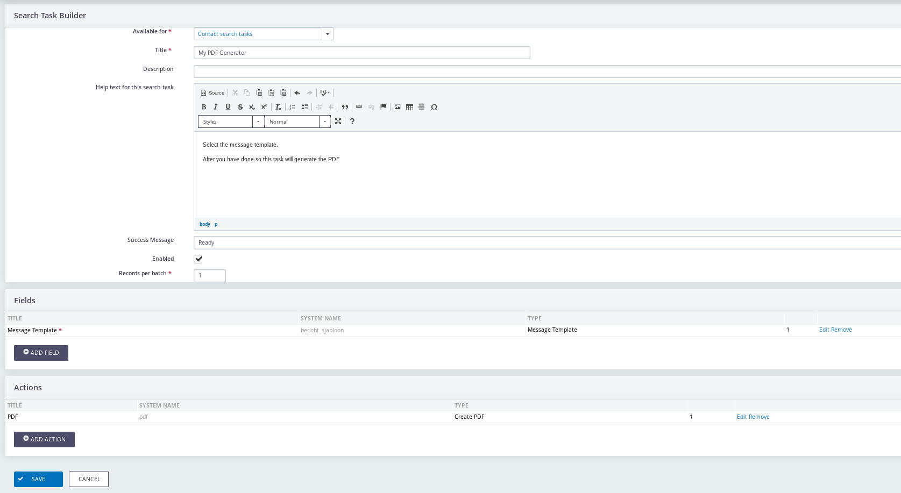
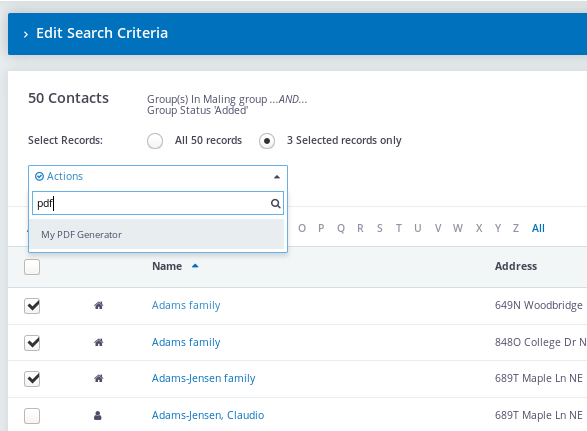
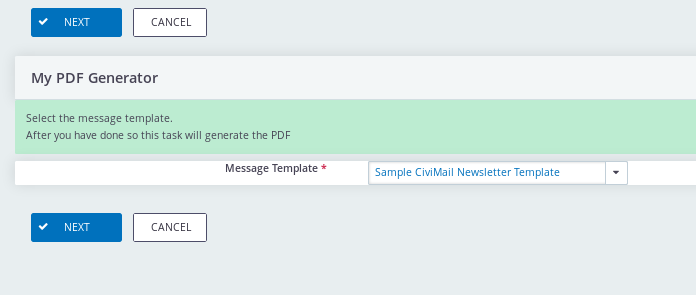

# Search Action Designer

With this extension you can build your own search actions. 

The extension is licensed under [AGPL-3.0](LICENSE.txt).

## Usage

After you have installed this extension you can design your search action under Administer --> Customize Data and Screens --> Search Action Designer.

## Documentation

* [How to create a search action for sending renewal letters and update the activity status](docs/create_a_search_action.md)
* [Exporting and importing a search action](docs/export_import.md)
* [How to install](docs/howto_install.md)

## Developer documentation

* [Hook documentation](docs/hooks.md) There is a hook to define the list for which search tasks are available. 
* [Storing search action in code your extension](docs/storing_search_actions.md)
