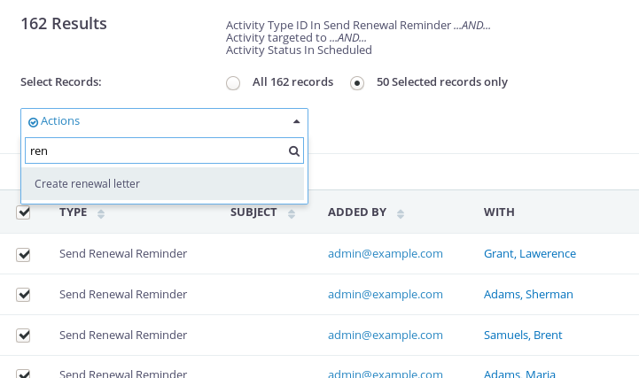
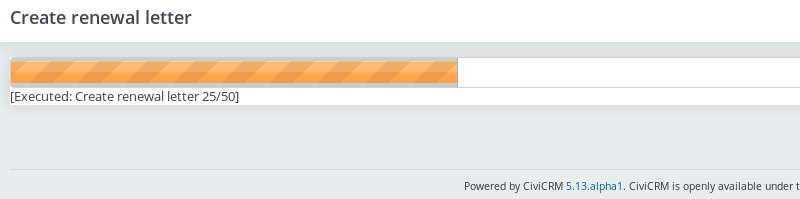
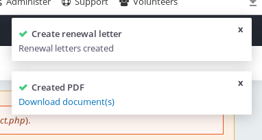
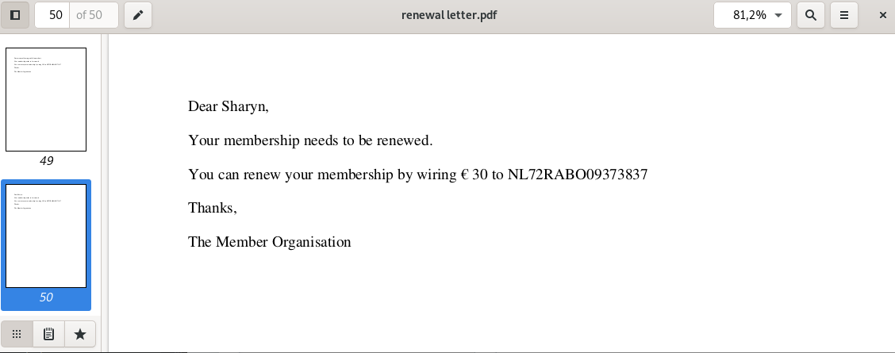

# Howto create a search action.

In this tutorial we are going to create a search action which will create a PDF 
for everyone who has an activity of Send Renewal Reminder scheduled. 
And sets the activity to completed.

This tutorial assumes you have successfully installed the Search Action Designer extension.
See here for [how to install](howto_install.md)

*How does our system look like?*

In our system Felisha Müller and others have a scheduled activity of the type *Send Renewal Reminder*

What we want to create is an action which creates the pdf for us and sets the activity to completed.

## Create the search action

Go to *Administer* then *Customize data and screens* and then *Search Action Designer* and press *Add search action*

In the next screen select that this search action is available for an activity search.
Give your search action a title. Such as 'Send renewal'. 
Optional give it a description. The description is only shown in the administration screen of the search action designer. 
Then enter a short help text, this help text is shown to the user just before executing the search action.
At the last step change the message which is shown to the user after the action has been executed.
Leave the records per batch. This setting defines how many records are updated in one batch.  If your action is slow you can lower this number.

Press **Next**

## Add the fields to the search action

We want the user to be able to select which message template they want to send and the new status.

**Add the message template field**

In the next screen press *Add Field*. And select the type *Message Template*. Give your field a title and set is required.
Optional you can also set a default value.

Press **Save**

**Add the activity status field**

When you are back in de *search action designer* screen press again on *Add Field*. And select by type *Option Group*. 
Give your field a title such as 'New activity status', check required as this is a required field.
At the option group drop down select the *Activity Status* option group.

Press **Save** 

## Add the actions

In this step we will add the actions. The first action is to retrieve the contacts from the activity, the next action 
is to create a PDF for this contact, and the last action is to update the status of the activity.

**Action to retrieve the contacts of an activity**

In the *search action designer* screen press *Add Action*  and select the action type *Get Contact IDs from Activity*.
Give the action a title, such as *Contacts*. 
Select by Record Type the Activity Targets
And by parameter mapping set Activity ID to *Activity ID*

Press **Save**

**Action to create the PDF**

In the *search action designer* screen press *Add Action* and select the action type *Create PDF*.
Give the action the title such as *Renewal letter*
Leave the filename. And by Parameter Mapping set Contact ID to *Action :: Contacts :: Contact IDs*
and set Message to *User input :: Message Template :: Message*

Press **Save**

**Action to update the activity status**

In the *search action designer* screen press *Add Action* and select the action type *Update Activity Status*
Give the action a title. And set by parameter mapping Activity ID to *Activity ID*  and Status ID to *User input :: New activity status :: Value*

Press **Save**

## Test the action

Our search action is now finished and it is time to test it. 

Go to search and then Find Activities. Search on activities of type *Send Renewal Reminder* and with status *Scheduled*

Select the activities which you want to process to send a reminder. And select by action our create action *Send renewal and set activity to completed*

In the next screen you see the fields we have defined in our search action. We also see the help text.
Select a message template and the status and press Next.

If your batch is large enough a progress bar is shown in the next screen. 

After the action is completed you are redirected to your search screen and a popup is shown. One that the action has been completed
and one with a link to download all the genereated PDFs. 

 

## The parameter mapping explained

The most important thing to understand is the mapping. Most actions require input data and provide output data. 
With the mapping we map data from either the search result screen (activity ID, contact ID, etc..), user input and output of other action
to the input of another action. 

That is also way we give each action a title, so we have a title in the drop down for parameter mapping.
The same principle applies to the user input (fields). Each field returns one or more values. 

