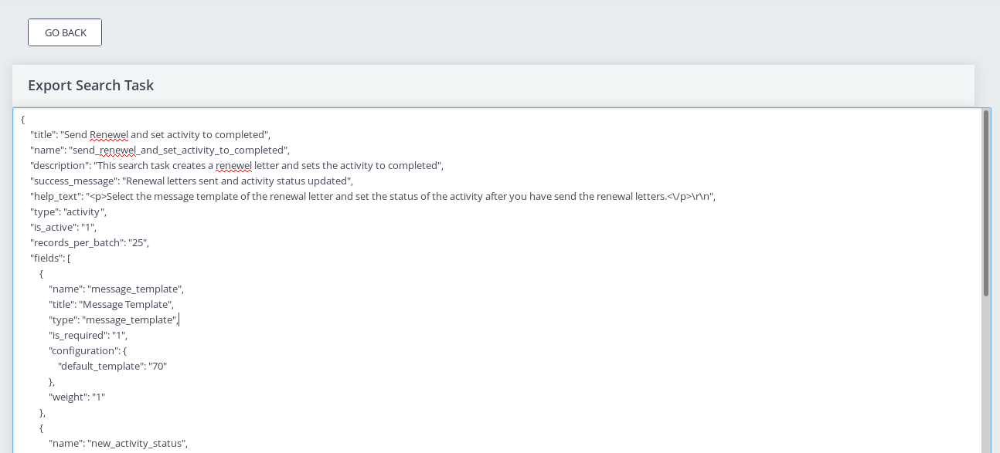
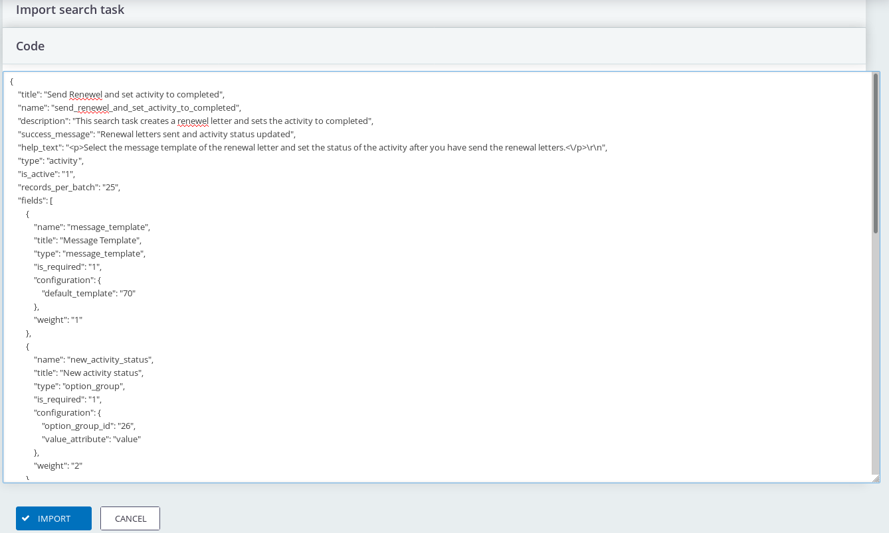

# Exporting and importing of search actions

You can also export a search action and import the search action in another CiviCRM installation or environment.
This could be useful if you have defined your search action in your test environment and you want to put it into production.

## Export

Go to **Administer > Customize data and screens > Search Action Designer** then click **Export** for the Search Action you want to export.
You will then see a screen like below. You can then select all the text in the big text area and copy the text. 

## Import

Go to **Administer > Customize data and screens > Search Action Designer > Import Search Action**
In the next screen *paste* the copied text from the export and press **Import**.

**Be careful:** if another search action with the same name already exists in your system this action will be overwritten. 
