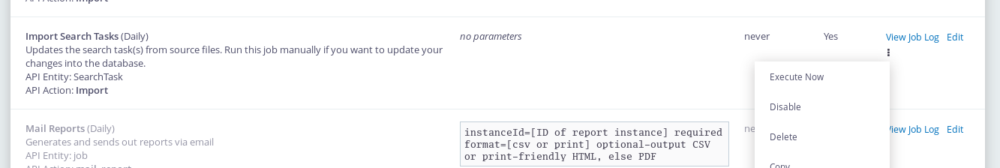

# Store search actions in your extension code.

It is possible to [export a search action](export_import.md) and store the code in your extension.

In your extension create a directory called `searchactions` and create a file for each action called `actionname.json`

The contents of the file could be copied from the export search action screen.

Importing or updating existing search action could then be done via Go to *Administer* then *System setting* and then *Scheduled Jobs* and select Import Search Tasks and press Execute now

 